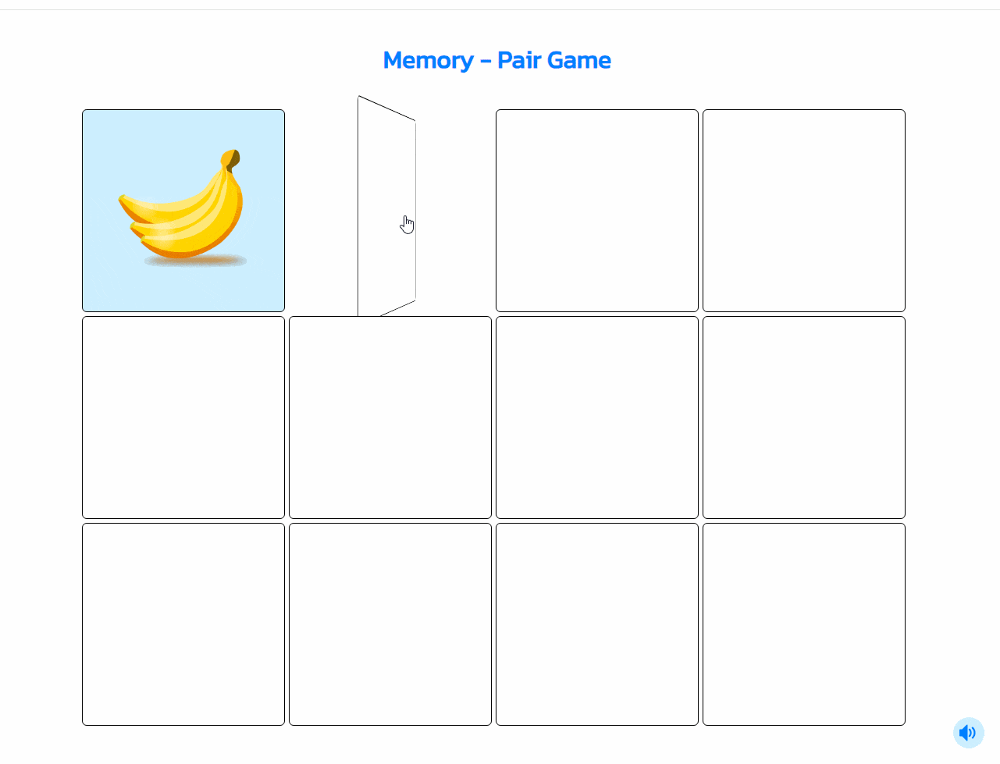

# Memory - Pair Game

A memory game challenges players to match pairs of hidden cards by revealing them one by one, requiring concentration, pattern recognition, and recall abilities. Participants strive to uncover identical images, testing their memory prowess as they flip over cards in pairs to find matches while keeping track of previously revealed patterns.

This app is created using the following technologies: HTML, CSS, JavaScript.